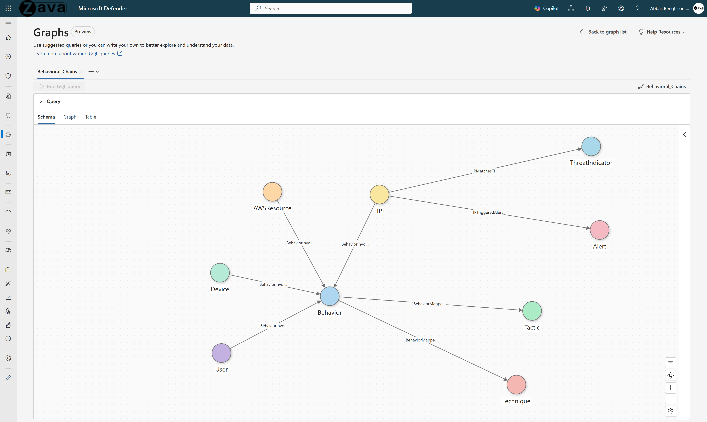

# Behavioral Attack Chain Analysis

## Use Case Overview

**Problem:** Nation-state actors chain benign-looking actions across MITRE ATT&CK tactics. A password spray, an OAuth token theft, a cloud role manipulation, and data exfiltration. Each event scores low individually. The chain across tactics and techniques on the SAME infrastructure is the signal that tabular alerting misses.

**What you can answer (fast):**
1. **Multi-technique convergence** - Show me all IPs/users that touch behaviors mapped to 3+ different MITRE techniques.
2. **Triple signal fusion** - Show me where TI match, security alert, and UEBA behavioral chain all point to the same IP/User/AWS Resource. Three independent detection systems agreeing on one entity.
3. **Connected context** - Show me which behaviors have a user, a device, AND an IP all connected.
4. **TI-to-behavior blast radius** - Follow the full path from a threat indicator through the matched IP through all associated behaviors to every affected user.

---

## 1. Why Graph?

Attackers don't execute isolated events. They execute **chains**: compromise an identity, move laterally across devices, escalate privileges, and reach objectives. Each step generates logs in different tables, but the **attack narrative** only emerges when these steps are connected as a traversable path.

**What tables can't do:**
- Tabular queries express fixed-hop joins (1–2 hops). Real attack chains span 3–8 hops across identity, device, alert, and network data.
- Self-joins for multi-hop traversal are computationally expensive and hard to author.
- Correlating alerts, logon events, and network connections across separate tables loses the sequential context.

**What graph unlocks:**
- **Arbitrary-depth traversal** - GQL `MATCH` with variable-length edges finds lateral movement chains regardless of depth.
- **Cross-domain correlation** - A single graph connects identity (who), device (where), alert (what), and network (how) into one investigable structure.
- **Kill chain scoring** - Graph path properties (risk levels, MITRE tactics) accumulate along traversal, enabling composite risk scores per attack chain.

---

## 2. Graph Schema

### Node Types

| Node Type | Source Table | Key Column | Display Column |
|-----------|-------------|------------|----------------|
| **Behavior** | SentinelBehaviorInfo | BehaviorId | Title |
| **Tactic** | SentinelBehaviorInfo (parsed) | Tactic | Tactic |
| **Technique** | SentinelBehaviorInfo (parsed) | Technique | Technique |
| **IP** | SentinelBehaviorEntities | IP | IP |
| **User** | SentinelBehaviorEntities | UserPrincipalName | UserPrincipalName |
| **AWSResource** | SentinelBehaviorEntities | AWSResourceArn | AWSResourceArn |
| **Device** | SentinelBehaviorEntities | DeviceId | DeviceName |
| **Alert** | AlertInfo + AlertEvidence | AlertId | Title |
| **ThreatIndicator** | ThreatIntelIndicators | Id | ObservableValue |

### Edge Types

| Edge Type | Source -> Target | Relationship |
|-----------|-----------------|--------------|
| **BehaviorMappedToTactic** | Behavior -> Tactic | Behavior maps to this MITRE tactic |
| **BehaviorMappedToTechnique** | Behavior -> Technique | Behavior maps to this MITRE technique |
| **BehaviorInvolvesIP** | Behavior -> IP | Behavior involves this IP address |
| **BehaviorInvolvesUser** | Behavior -> User | Behavior involves this user |
| **BehaviorInvolvesAWSResource** | Behavior -> AWSResource | Behavior involves this AWS resource |
| **BehaviorInvolvesDevice** | Behavior -> Device | Behavior involves this device |
| **IPTriggeredAlert** | IP -> Alert | IP is associated with this alert |
| **DeviceTriggeredAlert** | Device -> Alert | Device is associated with this alert |
| **UserTriggeredAlert** | User -> Alert | User is associated with this alert |
| **IPMatchesTI** | IP -> ThreatIndicator | IP matches a threat intelligence indicator |

### Key Properties

| Entity | Property | Description |
|--------|----------|-------------|
| Behavior | ActionType | Type of behavior detected |
| Behavior | ServiceSource | Source service that detected the behavior |
| Behavior | HourOfDay, DayOfWeek, IsWeekend | Temporal context for the behavior |
| Behavior | Description | Detailed behavior description |
| Alert | Severity | Alert severity (Low, Medium, High) |
| Alert | Category | Alert category (e.g., Lateral Movement, Credential Access) |
| ThreatIndicator | Confidence | TI confidence score |
| ThreatIndicator | ObservableKey | IOC type (domain-name:value, ipv4-addr:value) |

---

## 3. Prerequisites

### Required Data Connectors

| Connector | Table(s) | Purpose |
|-----------|----------|---------|
| [Microsoft Sentinel UEBA](https://learn.microsoft.com/azure/sentinel/identify-threats-with-entity-behavior-analytics) | SentinelBehaviorInfo, SentinelBehaviorEntities, BehaviorAnalytics | Behavior detections, entity extraction, investigation priority |
| [Microsoft 365 Defender](https://learn.microsoft.com/azure/sentinel/data-connectors/microsoft-365-defender) | AlertInfo, AlertEvidence | Security alerts and evidence entities |
| [Threat Intelligence](https://learn.microsoft.com/azure/sentinel/data-connectors/threat-intelligence) | ThreatIntelIndicators | IOC matching (STIX schema) |

### Reference Documentation

- [Sentinel Tables & Connectors Reference](https://learn.microsoft.com/azure/sentinel/sentinel-tables-connectors-reference)
- [Manage Data Overview](https://learn.microsoft.com/azure/sentinel/manage-data-overview)
- [Identify Threats with Entity Behavior Analytics (UEBA)](https://learn.microsoft.com/azure/sentinel/identify-threats-with-entity-behavior-analytics)
- [Enable Entity Behaviors Data Layer](https://learn.microsoft.com/azure/sentinel/entity-behaviors-layer)
- [SentinelBehaviorInfo Table Reference](https://learn.microsoft.com/azure/azure-monitor/reference/tables/sentinelbehaviorinfo)
- [SentinelBehaviorEntities Table Reference](https://learn.microsoft.com/azure/azure-monitor/reference/tables/sentinelbehaviorentities)

### SDK Requirements

- `sentinel_graph` >= 0.3.9
- `sentinel_lake` (MicrosoftSentinelProvider)

---

## 4. Business Questions This Graph Answers

1. Which behaviors map to the same MITRE tactics/techniques, indicating a coordinated attack chain?
2. Which users, devices, or IPs are involved in behaviors spanning multiple MITRE tactics?
3. Which IPs involved in suspicious behaviors also match threat intelligence indicators?
4. Which devices or users triggered security alerts AND are involved in detected behaviors?
5. Which behaviors involve AWS resources, indicating cross-cloud attack patterns?
6. What is the temporal distribution of behaviors (hour of day, weekend vs weekday)?
7. Which entities (users, IPs, devices) are most frequently involved across multiple behaviors?

---

## 5. Design Decisions

| # | Decision | Rationale |
|---|----------|-----------|
| 1 | **Behavior as central hub node** | The Behavior node connects to all entity types (User, IP, Device, AWSResource) and MITRE mappings (Tactic, Technique), making it the natural center of the graph. |
| 2 | **MITRE tactic/technique as separate nodes** | Elevating tactics and techniques from behavior properties to nodes enables cross-behavior correlation: "which behaviors share the same MITRE technique?" |
| 3 | **Entity extraction from SentinelBehaviorEntities** | Entities (users, IPs, devices, AWS resources) are parsed from the entities table and linked back to behaviors, preserving the many-to-many relationship. |
| 4 | **Alert bridging via shared entities** | Alerts are connected to the same entity nodes (IP, User, Device) as behaviors, enabling traversal from behavioral detections to correlated alerts. |
| 5 | **TI matching on IP nodes** | IPMatchesTI edges connect IP nodes to ThreatIndicator nodes, adding threat intelligence context to behaviorally suspicious IPs. |

---

## 6. Future Extensions

1. Add Azure resource nodes alongside AWS resources for multi-cloud coverage.
2. Add BehaviorAnalytics table integration for investigation priority scoring.
3. Add temporal sequencing to edges for attack timeline reconstruction.
4. Compute composite kill chain scores based on MITRE coverage breadth across connected behaviors.

---

## 7. File Inventory

| File | Description |
|------|-------------|
| `behavioral_attack_chain_graph.ipynb` | PySpark notebook building the behavioral attack chain graph |
| `behavioral_attack_chain_queries.md` | GQL query examples for investigation and hunting |
| `README.md` | This document - graph schema, design, and prerequisites |
