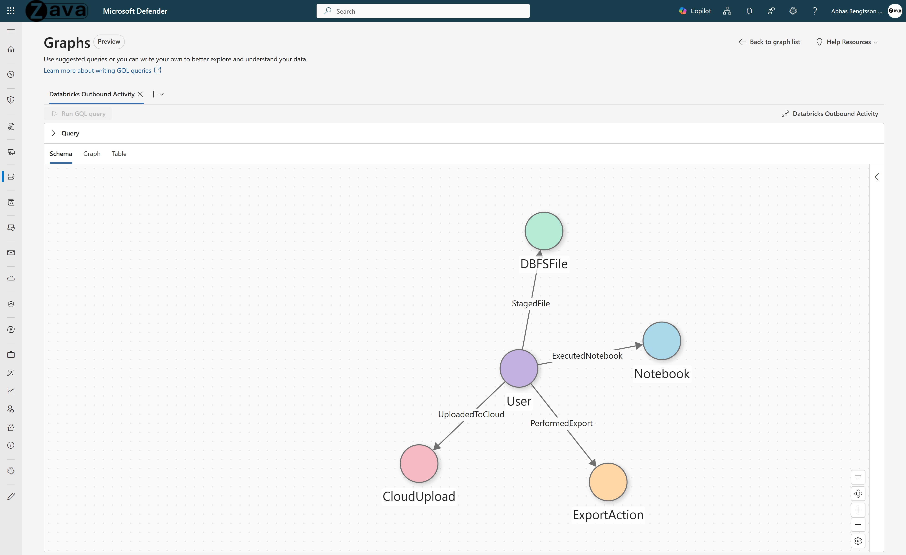

# Data Exfiltration Detection - Databricks Outbound Activity

## Use Case Overview

**Problem:** Databricks contains petabytes of sensitive data. Insider threats follow a predictable lifecycle: reconnaissance, staging, exfiltration. Each action is legitimate on its own. Data engineers export notebooks, write to DBFS, and upload files daily. The risk signal is the pattern: bulk exports, DBFS staging, and cloud uploads within a short window, only visible when you trace the full lifecycle through a shared User identity.

**What you can answer (fast):**
1. **Full exfiltration chain** - Show users who exported notebooks, staged files in DBFS, then uploaded data to personal cloud storage, the full 3-phase exfiltration chain through one identity.
2. **Capability stacking** - Show users with export, stage, upload, and execute actions radiating from a single node. Capability stacking is the highest-risk signal.
3. **Sensitive path + temporal anomaly** - Show exports of high-sensitivity paths that occurred after hours, combine temporal anomaly with data sensitivity.
4. **Bulk velocity** - Show users with 3+ notebook exports in rapid succession. Volume plus velocity distinguishes theft from normal work.
5. **Cross-platform bridge** - Show users appearing in both Databricks audit logs and cloud upload events, the cross-platform exfiltration bridge.

---

## 1. Why Graph?

Data exfiltration from Databricks environments spans **multiple disconnected platforms**: Databricks (access and staging) and cloud storage services (delivery). Each individual action appears legitimate. Data engineers regularly download notebooks and upload files. The exfiltration signal only emerges when user actions are **connected across platform boundaries**.

**What tables can't do:**
- Databricks audit logs and CloudAppEvents live in separate tables with different schemas and identity formats.
- Detecting the full export-to-upload chain requires temporal ordering across platform boundaries - a multi-step correlation that flat queries handle poorly.
- Distinguishing a departing employee systematically exfiltrating IP from a data engineer doing routine work is nearly impossible without cross-platform context.

**What graph unlocks:**
- **Cross-platform chain** - User -> PerformedExport -> ExportAction + User -> UploadedToCloud -> CloudUpload reveals the complete exfiltration lifecycle in a single traversal.
- **Temporal ordering** - Edge timestamps enable "upload after export" queries that filter legitimate activity from suspicious chains.
- **Risk amplification** - Graph properties combine action risk (HIGH/MEDIUM/LOW), path sensitivity, time-of-day, and identity risk level for composite scoring.

---

## 2. Graph Schema

### Node Types

| Node Type | Source Table | Key Column | Display Column |
|-----------|-------------|------------|----------------|
| **User** | DatabricksNotebook + DatabricksWorkspace + DatabricksDBFS + IdentityInfo | UserEmail | UserEmail |
| **Resource** | DatabricksNotebook + DatabricksDBFS + CloudAppEvents | ResourceId | ResourceId |
| **Capability** | Derived from activity patterns | CapabilityId | CapabilityId |

### Edge Types

| Edge Type | Source -> Target | Relationship |
|-----------|-----------------|--------------|
| **ACCESSED** | User -> Resource | User accessed this resource (notebook, DBFS path, cloud file) |
| **ResourceHasCapability** | Resource -> Capability | Resource has this capability classification |
| **UserHasCapability** | User -> Capability | User exhibits this capability based on activity patterns |

### Key Properties

| Entity | Property | Description |
|--------|----------|-------------|
| User | OutboundPathTypes | Types of outbound activity detected |
| User | TotalOutboundEvents | Total number of outbound events |
| User | UniqueResources | Count of distinct resources accessed |
| ACCESSED edge | ActionName | Specific action performed |
| ACCESSED edge | SourceIPAddress | Source IP of the action |
| UserHasCapability edge | EventCount | Number of events supporting this capability |

---

## 3. Prerequisites

### Required Data Connectors

| Connector | Table(s) | Purpose |
|-----------|----------|---------|
| [Azure Databricks (via Diagnostic Settings)](https://learn.microsoft.com/azure/sentinel/connect-services-diagnostic-setting-based) | DatabricksNotebook, DatabricksSecrets, DatabricksDBFS, DatabricksClusters, DatabricksJobs, DatabricksSQLPermissions | Databricks audit activity |
| [Microsoft Entra ID](https://learn.microsoft.com/azure/sentinel/data-connectors/microsoft-entra-id) | IdentityInfo | User identity enrichment (department, job title, manager) |
| [Microsoft Entra ID Identity Protection](https://learn.microsoft.com/azure/sentinel/data-connectors/microsoft-entra-id-protection) | AADUserRiskEvents | User risk event detection |
| [Microsoft Sentinel UEBA](https://learn.microsoft.com/azure/sentinel/identify-threats-with-entity-behavior-analytics) | BehaviorAnalytics | UEBA investigation priority scoring |

> **⚠️ Note:** This use case requires Azure Databricks audit logs flowing into your Microsoft Sentinel workspace. If your organization does not use Databricks, this graph will not have data.

### Reference Documentation

- [Sentinel Tables & Connectors Reference](https://learn.microsoft.com/azure/sentinel/sentinel-tables-connectors-reference)
- [Manage Data Overview](https://learn.microsoft.com/azure/sentinel/manage-data-overview)
- [DatabricksDBFS Table Reference](https://learn.microsoft.com/azure/azure-monitor/reference/tables/databricksdbfs)
- [DatabricksNotebook Table Reference](https://learn.microsoft.com/azure/azure-monitor/reference/tables/databricksnotebook)
- [DatabricksSecrets Table Reference](https://learn.microsoft.com/azure/azure-monitor/reference/tables/databrickssecrets)
- [DatabricksClusters Table Reference](https://learn.microsoft.com/azure/azure-monitor/reference/tables/databricksclusters)
- [DatabricksJobs Table Reference](https://learn.microsoft.com/azure/azure-monitor/reference/tables/databricksjobs)
- [DatabricksSQLPermissions Table Reference](https://learn.microsoft.com/azure/azure-monitor/reference/tables/databrickssqlpermissions)

### SDK Requirements

- `sentinel_graph` >= 0.3.9
- `sentinel_lake` (MicrosoftSentinelProvider)

---

## 4. Business Questions This Graph Answers

1. Which users exported 3+ notebooks in a short time window? (bulk export detection)
2. Which users performed high-risk actions outside business hours? (after-hours exfiltration)
3. Which users accessed sensitive paths (pii, sensitive) they don't typically use?
4. Which users created staging directories in DBFS `/tmp/` or `/staging/`?
5. Which users exported from Databricks AND subsequently uploaded to cloud storage? (full exfiltration chain)
6. What is the overall cloud upload volume per user and application?
7. Which users performed extensive directory listing across sensitive paths? (reconnaissance)

---

## 5. Design Decisions

| # | Decision | Rationale |
|---|----------|-----------|
| 1 | **User node as central hub** | All edge types connect from or through User - star topology mirrors the use case where all exfiltration centers on user actions. |
| 2 | **ExportAction unifies notebook + workspace exports** | DatabricksNotebook downloads and DatabricksWorkspace exports are unioned into one node type with a `sourceType` property to distinguish them. |
| 3 | **CloudAppEvents filtered to file actions** | Only FileUploaded, FileCreated, FileCopied, FileShared, FileDownloaded action types represent the delivery phase. |
| 4 | **Temporal ordering in chain queries** | Full exfiltration chain requires `upload.timestamp > export.timestamp` - upload must occur AFTER export. |
| 5 | **IdentityInfo enrichment via left join** | Preserves all users even if not in IdentityInfo. In production, enriches with department, risk level, manager. |
| 6 | **Keyword-based path sensitivity** | Sensitivity determined by substring matching ("pii", "sensitive", "finance"). Simple but effective for common naming conventions. |

---

## 6. Future Extensions

1. Real Databricks audit log integration when connector is available.
2. Add Session nodes for session-level anomaly detection.
3. Add IP/Device nodes for geographic anomaly correlation.
4. Volume-weighted risk scoring (action type × volume × sensitivity × time-of-day).

---

## 7. File Inventory

| File | Description |
|------|-------------|
| `databricks_outbound_exfiltration_graph.ipynb` | PySpark notebook building the exfiltration detection graph |
| `databricks_outbound_exfiltration_queries.md` | GQL query examples for investigation and hunting |
| `README.md` | This document - graph schema, design, and prerequisites |
