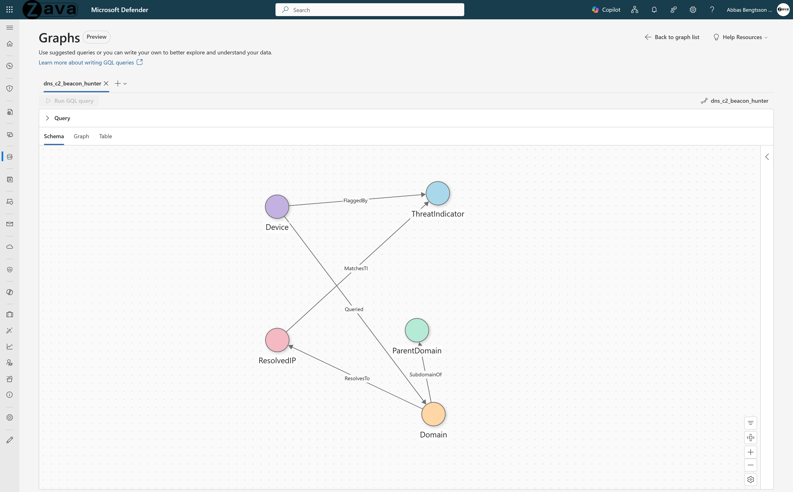

# DNS C2 Beacon Hunter

## Use Case Overview

**Problem:** Detection of C2 communication requires correlating DNS queries, network resolution data, and threat intelligence across multiple Sentinel tables. Beaconing behavior is hidden inside millions of legitimate DNS queries. Flat tables show individual events, but not the shared infrastructure or behavioral patterns behind them.

**What you can answer (fast):**
1. **Beaconing detection** - Show device-to-domain activity that exhibits beaconing behavior (low interval variance and high time coverage), separating automated traffic from human browsing.
2. **Full evidence chain** - Follow the chain from device to DNS query to resolved IP to threat indicator.
3. **Shared C2 infrastructure** - Identify devices resolving multiple domains to the same IP, revealing shared C2 infrastructure.
4. **Guilt by association** - Find domains that appear benign but share infrastructure with known malicious domains.
5. **DGA detection** - Detect DGA-style infrastructure where many randomized subdomains fan out from a single parent domain.

---

## 1. Why Graph?

DNS is a **universally permitted, rarely inspected** protocol. Every corporate firewall allows outbound DNS. Adversaries exploit this by using DNS for command-and-control (C2), encoding commands in DNS queries and responses. Detecting C2 beaconing requires combining **structural analysis** (which devices talk to which domains that resolve to which IPs matching TI indicators) with **behavioral analysis** (query regularity, timing patterns).

**What tables can't do:**
- DNS queries, network connections, device metadata, and threat intelligence live in separate tables. Correlating a device's DNS query pattern with the resolved IP's TI match status requires 3+ table joins.
- Beaconing detection requires computing inter-query intervals per device-domain pair - an expensive windowed aggregation that must then be joined back to structural data.
- "Guilt by association" queries (domains sharing IP infrastructure with TI-flagged domains) require graph traversal through shared ResolvedIP nodes.

**What graph unlocks:**
- **Structural + behavioral fusion** - The `Queried` edge carries 10 pre-computed beaconing metrics (CoeffOfVariation, ActiveHoursRatio, NxdomainRatio, etc.). The graph IS the analytics engine.
- **Multi-hop TI enrichment** - Device -> Domain -> ResolvedIP -> ThreatIndicator traversal in a single query.
- **Infrastructure clustering** - Domains sharing resolved IPs or parent domains cluster naturally, revealing campaign infrastructure.

---

## 2. Graph Schema

### Node Types

| Node Type | Source Table | Key Column | Display Column |
|-----------|-------------|------------|----------------|
| **Device** | DeviceInfo | DeviceId | DeviceName |
| **Domain** | DeviceNetworkEvents (DnsConnectionInspected) | QueryName | QueryName |
| **ParentDomain** | Derived from Domain | ParentDomain | ParentDomain |
| **ResolvedIP** | DeviceNetworkEvents (ConnectionSuccess) | RemoteIP | RemoteIP |
| **ThreatIndicator** | ThreatIntelIndicators (STIX) | Id | ObservableValue |

### Edge Types

| Edge Type | Source -> Target | Relationship |
|-----------|-----------------|--------------|
| **Queried** | Device -> Domain | Aggregated DNS query with beaconing metrics |
| **SubdomainOf** | Domain -> ParentDomain | Domain hierarchy relationship |
| **ResolvesTo** | Domain -> ResolvedIP | Domain resolves to this IP |
| **MatchesTI** (IP) | ResolvedIP -> ThreatIndicator | IP matches a TI indicator |
| **MatchesTI** (Domain) | Domain -> ThreatIndicator | Domain matches a TI indicator |

### Key Properties

| Entity | Property | Description |
|--------|----------|-------------|
| Device | ExposureLevel | Device exposure level (Low, Medium, High) |
| Device | IsInternetFacing | Whether device is internet-facing |
| Queried edge | CoeffOfVariation | Interval regularity - low CoV = mechanical beaconing |
| Queried edge | ActiveHoursRatio | Fraction of 24h with queries - high = 24/7 machine-like |
| Queried edge | NxdomainRatio | Fraction of NXDOMAIN responses - high = possible DGA |
| Queried edge | TopProcess | Most frequent process driving the DNS queries |
| ThreatIndicator | Confidence | TI confidence score |
| ThreatIndicator | ObservableKey | IOC type (domain-name:value, ipv4-addr:value) |

### Beaconing Detection Algorithm

The core innovation of this graph is that **the analytics live on the edges**. Each `Queried` edge between a Device and a Domain carries 6 pre-computed beaconing metrics, computed at graph build time. No runtime computation needed during investigation.

**Why this matters:** Malware beacons operate in patterns. A C2 implant checks in every 60 seconds with mechanical precision. A human browsing the same domain shows irregular, clustered access. The difference is measurable.

#### How it works

For each (Device, Domain) pair, the notebook:

1. **Orders** all DNS query events by timestamp
2. **Computes inter-query intervals** using a window `lag()` function: time between consecutive queries in seconds
3. **Aggregates** the interval series into statistical metrics

#### Metrics Reference

| Metric | Formula | What it detects | Beacon signal |
|--------|---------|----------------|---------------|
| **MeanIntervalSec** | `avg(interval)` | Average time between queries | ~60s = 1-min beacon, ~300s = 5-min beacon |
| **StddevIntervalSec** | `stddev(interval)` | Variation in query timing | Low stddev = mechanical regularity |
| **CoeffOfVariation** | `stddev / mean` | Normalized regularity score | < 0.3 = strong beacon, > 1.0 = human-like |
| **ActiveHoursRatio** | `distinct_hours / 24` | Fraction of the day with queries | ~1.0 = 24/7 machine, ~0.3 = business hours only |
| **NxdomainRatio** | `nxdomain_count / total_count` | Fraction of failed DNS lookups | > 0.5 = possible DGA or DNS tunneling |
| **UniqueAnswerCount** | `countDistinct(answers)` | Number of distinct DNS responses | High = fast-flux C2 infrastructure |

#### Detection Patterns

| Pattern | CoeffOfVariation | ActiveHoursRatio | NxdomainRatio | Interpretation |
|---------|:---:|:---:|:---:|----------------|
| C2 Beacon | < 0.3 | > 0.8 | Low | Mechanical regularity, runs 24/7 |
| DGA/Tunneling | Any | Any | > 0.5 | High failure rate = algorithmically generated domains |
| Fast-flux C2 | < 0.5 | > 0.8 | Low | Regular timing + many distinct IPs |
| Normal browsing | > 1.0 | < 0.5 | < 0.1 | Irregular, business-hours only |

#### Tuning

These thresholds are used in the GQL queries (not hardcoded in the notebook). Adjust them based on your environment:

- **CoeffOfVariation < 0.3**: Strict beacon detection. Increase to 0.5 for broader coverage with more false positives.
- **ActiveHoursRatio > 0.8**: Filters to near-24/7 activity. Lower to 0.5 to include business-hours-only beacons.
- **NxdomainRatio > 0.3**: DGA threshold. Raise to 0.5 for higher confidence.
- **QueryCount**: Add a minimum threshold (e.g., `> 50`) to exclude low-volume noise.

---

## 3. Prerequisites

### Required Data Connectors

| Connector | Table(s) | Purpose |
|-----------|----------|---------|
| [Microsoft Defender for Endpoint](https://learn.microsoft.com/azure/sentinel/data-connectors/microsoft-defender-for-endpoint) | DeviceNetworkEvents, DeviceInfo | DNS queries, connections, device context |
| [Threat Intelligence](https://learn.microsoft.com/azure/sentinel/data-connectors/threat-intelligence) | ThreatIntelIndicators | IOC matching (STIX schema) |

### Reference Documentation

- [Sentinel Tables & Connectors Reference](https://learn.microsoft.com/azure/sentinel/sentinel-tables-connectors-reference)
- [Manage Data Overview](https://learn.microsoft.com/azure/sentinel/manage-data-overview)

### SDK Requirements

- `sentinel_graph` >= 0.3.9
- `sentinel_lake` (MicrosoftSentinelProvider)

---

## 4. Business Questions This Graph Answers

1. Which devices are talking to domains or IPs that match threat-intelligence indicators?
2. Which DNS relationships look mechanically regular (possible beaconing) based on interval variance?
3. Which connections appear 24/7 machine-like rather than user-driven?
4. Which domains have suspicious subdomain fan-out (possible tunneling or DGA)?
5. Which domains share IP infrastructure with TI-matched domains (guilt-by-association)?
6. Which processes are driving suspicious DNS behavior on a device?
7. Which devices should be prioritized using exposure context plus TI/beacon evidence?

---

## 5. Design Decisions

| # | Decision | Rationale |
|---|----------|-----------|
| 1 | **Use ThreatIntelIndicators (STIX) instead of retired ThreatIntelligenceIndicator** | Aligns with post-migration STIX schema and future-proofs the graph. |
| 2 | **Split DeviceNetworkEvents into DNS and connection pipelines** | DNS query domain is in `AdditionalFields.query` (JSON), while IP mapping comes from `ConnectionSuccess` rows - different ActionTypes, different extraction logic. |
| 3 | **Compute beaconing metrics during graph build** | Shifts expensive interval analytics to build-time, enabling direct GQL filtering on edges without runtime computation. |
| 4 | **Filter out `.arpa` domains** | Reduces reverse-lookup noise in Domain and parent-domain topology. |
| 5 | **Parent-domain heuristic (last 2–3 parts)** | Avoids over-collapsing cloud domains (e.g., `blob.core.windows.net` stays distinct from `windows.net`). |
| 6 | **Apply explicit time windows and `.persist()`** | Prevents unbounded scans and improves notebook runtime stability. |

---

## 6. Future Extensions

1. Add ASN/Geo enrichment for ResolvedIP nodes for infrastructure clustering.
2. Expand TI matching to additional observable types.
3. Add process or binary nodes for LOLBin-driven DNS hunting.
4. Add temporal-sequence edges for beacon campaign progression analysis.

---

## 7. File Inventory

| File | Description |
|------|-------------|
| `dns_c2_beacon_hunter_graph.ipynb` | PySpark notebook building the DNS C2 beacon detection graph |
| `dns_c2_beacon_hunter_queries.md` | GQL query examples for investigation and hunting |
| `README.md` | This document - graph schema, design, and prerequisites |
