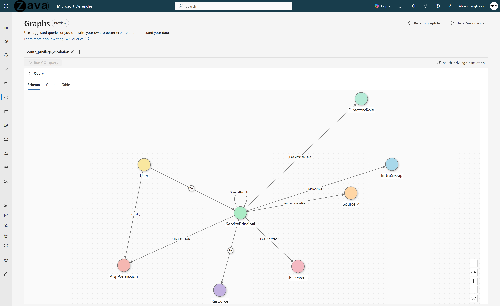

# OAuth & Service Principal Privilege Escalation

## Use Case Overview

**Problem:** OAuth service principals in Entra ID are a large, under-monitored attack surface. Service principals run autonomously with long-lived credentials. Permission chaining, credential injection, and transitive reachability to Tier Zero roles are invisible in flat audit logs. A single service principal with AppRoleAssignment.ReadWrite.All can self-escalate to Global Administrator without human approval.

**What you can answer (fast):**
1. **Self-escalation cycles** - Show service principals that granted permissions to themselves, then chained those permissions to reach a Tier Zero directory role.
2. **Delegation chains** - Follow delegation chains SP to SP to DirectoryRole. Identify service principals that can reach Tier Zero within 3 hops without a direct assignment.
3. **Credential backdoors** - Show users who added credentials to service principals they do not own. Secret injection without ownership indicates a backdoor.
4. **Compromised consent** - Show high-risk users authorizing sensitive permissions to their own applications.
5. **Supply chain blast radius** - Starting from third-party service principals, map all permissions, delegated grants, and reachable roles. Full blast radius of vendor compromise.

---

## 1. Why Graph?

Privilege escalation through service principals involves **chains** of consent grants, ownership transfers, credential additions, and directory role assignments. These chains are **invisible in flat audit logs** - each individual AuditLog entry looks like a routine admin operation. Only when connected as a graph does the escalation pattern emerge.

**What tables can't do:**
- Detecting a self-grant escalation chain (SP1 grants permission to SP2, SP2 adds credentials, SP2 gets Global Admin role) requires correlating 3+ separate AuditLog entries with different OperationNames, linked by ServicePrincipalId.
- "Who can reach Tier Zero roles?" is a reachability question - fundamentally a graph traversal, not a table join.
- Supply chain risk (third-party SPs with granted permissions to internal SPs that hold sensitive roles) requires multi-hop traversal across consent, ownership, and role assignment edges.

**What graph unlocks:**
- **Consent chain traversal** - User -> ConsentedTo -> SP -> GrantedPermissionTo -> SP -> HasDirectoryRole -> DirectoryRole reveals the full privilege chain.
- **Tier Zero reachability** - "From any node, can I reach a DirectoryRole where IsTierZero = true?" in one GQL query.
- **Credential backdoor detection** - AddedSecretTo edges combined with OwnsApp edges surface credential addition by owners - the precondition for SP impersonation.
- **Risk amplification** - SP risk events + user risk levels + sensitive API calls combine for composite threat scoring.

---

## 2. Graph Schema




### Node Types

| Node Type | Source Table | Key Column | Display Column |
|-----------|-------------|------------|----------------|
| **ServicePrincipal** | EntraServicePrincipals | ServicePrincipalId | DisplayName |
| **AppPermission** | AuditLogs | PermissionId | PermissionName |
| **User** | AuditLogs | UserId | UserPrincipalName |
| **Resource** | MicrosoftGraphActivityLogs | ResourceUri | ResourceUri |
| **SourceIP** | AADServicePrincipalSignInLogs | IPAddress | IPAddress |
| **DirectoryRole** | AuditLogs | RoleId | RoleName |
| **RiskEvent** | AADServicePrincipalRiskEvents | RiskEventId | RiskEventType |
| **EntraGroup** | AuditLogs | GroupId | GroupName |

### Edge Types

| Edge Type | Source -> Target | Relationship |
|-----------|-----------------|--------------|
| **HasPermission** | ServicePrincipal -> AppPermission | SP holds this OAuth permission |
| **GrantedBy** | AppPermission -> User | Permission was granted by this user |
| **CalledAPI** | ServicePrincipal -> Resource | SP called this Graph API endpoint |
| **AuthenticatedAs** | SourceIP -> ServicePrincipal | IP authenticated as this SP |
| **GrantedPermissionTo** | ServicePrincipal -> ServicePrincipal | SP granted permissions to another SP |
| **HasDirectoryRole** | ServicePrincipal -> DirectoryRole | SP holds this directory role |
| **OwnsApp** | User -> ServicePrincipal | User owns this application/SP |
| **AddedSecretTo** | User -> ServicePrincipal | User added credentials to this SP |
| **HasRiskEvent** | ServicePrincipal -> RiskEvent | SP has a risk detection event |
| **MemberOf** | ServicePrincipal -> EntraGroup | SP is a member of this group |
| **CalledSensitiveAPI** | ServicePrincipal -> Resource | SP called a sensitive API endpoint |

### Key Properties

| Entity | Property | Description |
|--------|----------|-------------|
| ServicePrincipal | SpRiskLevel | Risk level from AADRiskyServicePrincipals |
| ServicePrincipal | SpRiskState | Risk state (atRisk, confirmedCompromised, etc.) |
| User | UserRiskLevel | Risk level from AADRiskyUsers |
| DirectoryRole | IsTierZero | Whether the role is Tier Zero (Global Admin, PRA, etc.) |
| All edges | EdgeFirstSeen | First occurrence timestamp |
| All edges | EdgeLastSeen | Last occurrence timestamp |

---

## 3. Prerequisites

### Required Data Connectors

| Connector | Table(s) | Purpose |
|-----------|----------|---------|
| [Microsoft Entra ID](https://learn.microsoft.com/azure/sentinel/data-connectors/microsoft-entra-id) | AuditLogs | Consent grants, role assignments, ownership, credentials |
| [Microsoft Entra ID](https://learn.microsoft.com/azure/sentinel/data-connectors/microsoft-entra-id) | AADServicePrincipalSignInLogs | SP authentication and credential metadata |
| [Microsoft Entra ID Identity Protection](https://learn.microsoft.com/azure/sentinel/data-connectors/microsoft-entra-id-protection) | AADRiskyServicePrincipals, AADServicePrincipalRiskEvents, AADRiskyUsers | Risk detection |
| Microsoft Entra ID | EntraServicePrincipals | SP inventory |
| [Microsoft Graph Activity Logs](https://learn.microsoft.com/azure/sentinel/data-connectors/microsoft-graph-activity-logs) | MicrosoftGraphActivityLogs | API call activity |

### Reference Documentation

- [Sentinel Tables & Connectors Reference](https://learn.microsoft.com/azure/sentinel/sentinel-tables-connectors-reference)
- [Manage Data Overview](https://learn.microsoft.com/azure/sentinel/manage-data-overview)

### SDK Requirements

- `sentinel_graph` >= 0.3.9
- `sentinel_lake` (MicrosoftSentinelProvider)

### Configurable Values

The notebook includes predefined lists that customers can override with their own values:

**Sensitive API Patterns** (used for `CalledSensitiveAPI` edge):

```
/roleManagement/, /directoryRoles/, /appRoleAssignments,
/oauth2PermissionGrants, /servicePrincipals/*/addPassword,
/servicePrincipals/*/addKey, /applications/*/addPassword,
/applications/*/addKey, /applications/*/owners,
/servicePrincipals/*/owners, /privilegedAccess/, /policies/
```

**Tier Zero Directory Roles** (used for `IsTierZero` flag on DirectoryRole nodes):

Tier Zero roles are the most privileged roles in Microsoft Entra ID. An identity that holds any of these roles has full or near-full control over the tenant, including the ability to escalate privileges, reset credentials, and modify security policies. Compromise of a Tier Zero role is equivalent to full tenant compromise. The graph flags these roles with `IsTierZero = true` to enable reachability queries like "can any service principal reach a Tier Zero role?"

```
Global Administrator, Privileged Role Administrator,
Privileged Authentication Administrator, Application Administrator,
Cloud Application Administrator, Partner Tier2 Support,
Security Administrator
```

> **💡 Tip:** Update these lists in the notebook's configuration cell to match your organization's security policies and role definitions.

---

## 4. Business Questions This Graph Answers

1. Which SPs granted themselves permissions to reach Tier Zero roles? (CVE-2025-55241 pattern)
2. Who controls which SPs, and can they escalate through ownership chains?
3. Who recently added secrets/credentials to service principals?
4. Which risky SPs hold dangerous permissions?
5. Were consent-granting users themselves compromised?
6. Which SPs inherit access through group membership (hidden privilege)?
7. Which SPs call sensitive API endpoints (roleManagement, addPassword)?
8. What new edges appeared in the last 7 days? (posture drift)

---

## 5. Design Decisions

| # | Decision | Rationale |
|---|----------|-----------|
| 1 | **DirectoryRole nodes with IsTierZero flag** | Enables "can entity X reach Tier Zero?" reachability queries - the core escalation detection question. |
| 2 | **GrantedPermissionTo (SP->SP) edge** | Captures app-initiated permission grants - the mechanism for self-grant escalation chains. |
| 3 | **Temporal edge properties** | EdgeFirstSeen/EdgeLastSeen on all edges enables "what changed since last week?" posture drift queries. |
| 4 | **CalledSensitiveAPI as separate edge** | Filtered subset of CalledAPI targeting sensitive endpoints (roleManagement, addPassword, etc.). Higher signal for escalation detection. |
| 5 | **SP risk enrichment via left join** | AADRiskyServicePrincipals adds risk context without dropping SPs that aren't flagged. |

---

## 6. Future Extensions

1. Add OAuth permission classification (Application vs. Delegated, risk tier).
2. Add Conditional Access policy nodes for policy bypass detection.
3. Cross-tenant SP analysis for multi-tenant environments.
4. Automated Tier Zero path alerting via scheduled graph builds.

---

## 7. File Inventory

| File | Description |
|------|-------------|
| `oauth_privilege_escalation_graph.ipynb` | PySpark notebook building the OAuth privilege escalation graph |
| `oauth_privilege_escalation_queries.md` | GQL query examples for investigation and hunting |
| `README.md` | This document - graph schema, design, and prerequisites |
