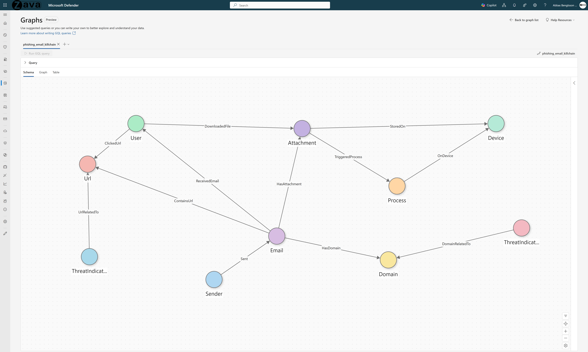

# Phishing Email-to-Endpoint Kill Chain

## Use Case Overview

**Problem:** Phishing investigations require stitching together evidence across multiple data sources (email delivery, link click, proxy verdict, endpoint execution). Today, no single view shows the full story end-to-end.

**What you can answer (fast):**
1. **Blast radius** - Who received the phishing email, who clicked, and which clicks were actually allowed by the proxy?
2. **Live risk** - Which delivered emails have no remediation action tied to them (potential threats still sitting in inboxes)?
3. **Campaign linkage** - Which emails point to the same URL (reveals waves using shared infrastructure)?
4. **Proof of execution** - Follow attachment to download to process execution to device to show the chain from inbox to compromise.
5. **Delivered vs executed bridge** - Which attachment hashes observed in email also appear as running processes on endpoints?

---

## 1. Why Graph?

When a phishing email is identified, security teams need to rapidly determine: who received it, where it landed, who clicked, whether clicks reached the destination, and if attachments executed on endpoints. This investigation currently requires correlating **7+ separate Sentinel tables** with manual joins on NetworkMessageId, UPN, URL domains, SHA256 hashes, and temporal proximity.

**What tables can't do:**
- The full phishing kill chain spans email delivery (EmailEvents), URL extraction (EmailUrlInfo), click tracking (UrlClickEvents), attachment metadata (EmailAttachmentInfo), endpoint file events (DeviceFileEvents), process execution (DeviceProcessEvents), and threat intelligence (ThreatIntelIndicators). Each requires separate KQL queries and manual correlation.
- SHA256 correlation between email attachments and endpoint process execution requires cross-source joins that KQL handles poorly.
- Determining blast radius (how many users received, clicked, and were affected) requires aggregating across all these sources simultaneously.

**What graph unlocks:**
- **Seven-table fusion** - Email, URL, attachment, click, file download, process execution, device, and threat intelligence in one traversable structure.
- **Instant blast radius** - "For this campaign, how many users received, clicked, and had attachments execute?" in one GQL query.
- **Cross-source correlation** - SHA256 hash links email attachments to endpoint processes. URL domains link email URLs to threat intelligence.
- **Kill chain reconstruction** - Trace from sender through email to URL click to attachment download to process execution to device in a single traversal.

---

## 2. Graph Schema

### Node Types

| Node Type | Source Table | Key Column | Display Column |
|-----------|-------------|------------|----------------|
| **Email** | EmailEvents | EmailId (NetworkMessageId) | Subject |
| **Sender** | EmailEvents | SenderEmail (SenderFromAddress) | SenderEmail |
| **User** | EmailEvents + UrlClickEvents | UserEmail (RecipientEmailAddress) | UserEmail |
| **Url** | EmailUrlInfo | UrlId (Url) | UrlDomain |
| **Domain** | EmailUrlInfo | DomainId (UrlDomain) | DomainId |
| **Attachment** | EmailAttachmentInfo | AttachmentId (SHA256) | FileName |
| **Process** | DeviceProcessEvents | ProcessId (DeviceName_FileName_TimeGenerated) | FileName |
| **Device** | DeviceProcessEvents | DeviceId (DeviceName) | DeviceName |
| **ThreatIndicator_Domain** | ThreatIntelIndicators | TIDomain | TIDomain |
| **ThreatIndicator_Url** | ThreatIntelIndicators | TIUrl | TIUrl |

### Edge Types

| Edge Type | Source -> Target | Relationship |
|-----------|-----------------|--------------|
| **Sent** | Sender -> Email | Sender sent this email |
| **ReceivedEmail** | Email -> User | Email was delivered to user |
| **ContainsUrl** | Email -> Url | Email contains this URL |
| **HasDomain** | Email -> Domain | Email references this domain |
| **HasAttachment** | Email -> Attachment | Email has this attachment |
| **ClickedUrl** | User -> Url | User clicked this URL |
| **StoredOn** | Attachment -> Device | Attachment file was saved on this device (via Outlook) |
| **DownloadedFile** | User -> Attachment | User downloaded this file on endpoint |
| **TriggeredProcess** | Attachment -> Process | Attachment triggered this process execution |
| **OnDevice** | Process -> Device | Process executed on this device |
| **DomainRelatedTo** | ThreatIndicator_Domain -> Domain | TI domain matches a domain in the graph |
| **UrlRelatedTo** | ThreatIndicator_Url -> Url | TI URL matches a URL in the graph |

### Key Properties

| Entity | Property | Description |
|--------|----------|-------------|
| Email | DeliveryAction | Delivered, Blocked, Replaced |
| Email | DeliveryLocation | Inbox, Quarantine, Junk |
| Email | SenderFromAddress | Sender email address |
| Email | ThreatTypes | Detected threat types |
| ClickedUrl edge | IsClickedThrough | Whether user clicked through Safe Links warning |
| Attachment | ThreatTypes, ThreatNames | Detected threats on the attachment |
| Attachment | FileType, FileSize | Attachment metadata |
| ThreatIndicator | Confidence | TI confidence score |
| StoredOn edge | (via Outlook) | Only files extracted by outlook.exe are linked |

---

## 3. Prerequisites

### Required Data Connectors

| Connector | Table(s) | Purpose |
|-----------|----------|---------|
| [Microsoft Defender for Office 365](https://learn.microsoft.com/azure/sentinel/data-connectors/microsoft-defender-for-office-365) | EmailEvents, EmailUrlInfo, UrlClickEvents, EmailAttachmentInfo | Email telemetry |
| [Microsoft Defender for Endpoint](https://learn.microsoft.com/azure/sentinel/data-connectors/microsoft-defender-for-endpoint) | DeviceProcessEvents, DeviceFileEvents | Endpoint process and file events |
| [Threat Intelligence](https://learn.microsoft.com/azure/sentinel/data-connectors/threat-intelligence) | ThreatIntelIndicators | Domain and URL IOC matching (STIX schema) |

### Reference Documentation

- [Sentinel Tables & Connectors Reference](https://learn.microsoft.com/azure/sentinel/sentinel-tables-connectors-reference)
- [Manage Data Overview](https://learn.microsoft.com/azure/sentinel/manage-data-overview)

### SDK Requirements

- `sentinel_graph` >= 0.3.9
- `sentinel_lake` (MicrosoftSentinelProvider)

---

## 4. Business Questions This Graph Answers

1. For this phishing campaign (sender/subject), how many users received the email and where was it delivered (Inbox, Quarantine, Junk)?
2. Which users clicked on URLs contained in phishing emails?
3. Which email attachments were saved on endpoint devices via Outlook?
4. Which attachments triggered process execution on endpoints?
5. Can we trace the complete chain from sender through email to URL click to attachment execution to device?
6. Which URLs or domains match threat intelligence indicators?
7. Which endpoint devices have been exposed to processes triggered by phishing attachments?
8. Which users have the highest composite exposure across email receipt, URL clicks, and attachment downloads?

---

## 5. Design Decisions

| # | Decision | Rationale |
|---|----------|-----------|
| 1 | **Seven-table fusion across 3 data sources** | The complete phishing picture requires MDO email tables (4), MDE endpoint tables (2), and ThreatIntelIndicators (1). |
| 2 | **Email key = NetworkMessageId** | Microsoft's unique email identifier, stable across all MDO tables. |
| 3 | **User key = RecipientEmailAddress (normalized)** | `lower(trim())` normalization handles case inconsistencies across data sources. Users are unioned from EmailEvents recipients AND UrlClickEvents clickers. |
| 4 | **Attachment key = SHA256 hash** | Hash-based keying enables the critical cross-source correlation between email attachments and endpoint processes. |
| 5 | **StoredOn edge via Outlook process** | Filters DeviceFileEvents to `InitiatingProcessFileName == "outlook.exe"` and `ActionType == "FileCreated"` to capture only email attachment extraction, not general file activity. |
| 6 | **Separate Domain and Url nodes** | Domains group multiple URLs under one entity. TI matching works at both domain level (DomainRelatedTo) and URL level (UrlRelatedTo). |
| 7 | **ThreatIndicator split into Domain and Url types** | Separate node types for domain-based and URL-based TI indicators enables precise matching without type confusion. |

---

## 6. Future Extensions

1. Add ZAP (Zero-hour Auto Purge) remediation edges from EmailPostDeliveryEvents.
2. Add proxy verdict edges from CommonSecurityLog (Zscaler or other web proxy) to show allow/block decisions on clicked URLs.
3. Add sender reputation nodes for campaign attribution across multiple phishing waves.
4. Add URL reputation enrichment from ThreatIntelIndicators for real-time IOC scoring.
5. Add temporal analysis for campaign timeline reconstruction.

---

## 7. File Inventory

| File | Description |
|------|-------------|
| `phishing_email_killchain_graph.ipynb` | PySpark notebook building the phishing kill chain graph |
| `phishing_email_killchain_queries.md` | GQL query examples for investigation and hunting |
| `README.md` | This document - graph schema, design, and prerequisites |
