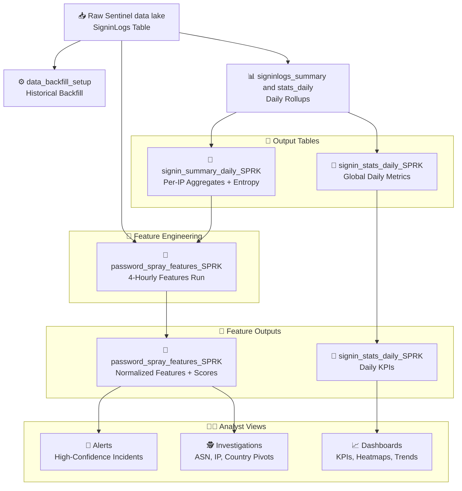

# 🔐 Password Spray Detection – End-to-End Pipeline

This folder contains a suite of Spark notebooks that implement a **modular, cost-efficient pipeline** for detecting password spray attacks in Microsoft Entra ID `SigninLogs`.

---

## 📖 Workflow summary

1. **`data_backfill_setup`**

   - Bootstraps the pipeline with historical data.
   - Populates `signin_summary_daily_SPRK` and `signin_stats_daily` for lookbacks.
   - Ensures the system can analyze **weeks of history** without rescanning raw logs.

2. **`signinlogs_summaryandstats_daily`**

   - Daily job that rolls raw `SigninLogs` into:
     - `signin_summary_daily_SPRK` → per-IP aggregates with entropy.
     - `signin_stats_daily_SPRK` → global daily statistics (users, IPs, lockouts).
   - Forms the **cost-efficient foundation** for long lookbacks.

3. **`password_spray_features_SPRK`**
   - Runs every 4 hours.
   - Uses **fresh raw SigninLogs** (short window) + **historical summary table** (long lookback).
   - Generates **normalized per-IP features**, computes a **spray_score**, and assigns labels.
   - Outputs `password_spray_features_SPRK` for **alerts, dashboards, and investigations**.

---

## 💰 Why this design is cost-efficient

- 🔹 Long lookbacks are **summarized once daily** (summary tables) instead of rescanning large `SigninLogs`.
- 🔹 Frequent runs (every 4h) only process a **small fresh batch** plus compact history.
- 🔹 This balances **real-time detection** (catch bursts quickly) with **historical visibility** (low-and-slow campaigns).

---

## 🚀 Outputs & use cases

- **Alerts** → trigger on high spray_score IPs.
- **KPI Dashboards** → monitor lockouts, distinct IPs, spray attempts.
- **Investigations** → pivot into ASN, country, or recurring IP activity.
- **Baselines** → compare current spray behavior to long-term trends.

---

## 🏗️ High-level architecture

## 📚 Table catalog

### 1. 🗂️ `signin_summary_daily_SPRK`

**Purpose:** Compact **per-IP, per-day** rollups from raw `SigninLogs`.  
**Use Cases:** Efficient historical lookbacks, building features for spray scoring.

**Schema (simplified):**

- 📅 `date` → reporting day
- 🌍 `IPAddress`, `ASN`, `City`, `Country` → source attribution
- 🔢 `attempts_total` → total attempts from this IP
- ✅ `success_count` → successful logons
- 👤 `distinct_users` → unique targeted accounts
- ⏱️ `first_seen` / `last_seen` → time bounds for the IP’s activity that day
- 🧮 `username_entropy` → spread/randomness of targeted usernames

---

### 2. 📊 `signin_stats_daily_SPRK`

**Purpose:** **Global daily metrics** across all IPs, independent of attribution.  
**Use Cases:** KPI dashboards, trend analysis, volume monitoring.

**Schema (simplified):**

- 📅 `date` → reporting day
- 🔢 `total_attempts` → all attempts that day
- 👤 `distinct_targeted_users` → number of accounts targeted
- 🌐 `distinct_source_ips` → unique IPs seen
- 🚫 `lockouts` → failed attempts leading to lockout (`ResultType=50053`)
- ✅ `successes` → successful logons

---

### 3. 🎯 `password_spray_features_SPRK`

**Purpose:** **Feature-engineered per-IP dataset** that powers alerts, dashboards, and investigations.  
**Use Cases:** Detecting **burst attacks** and **low-and-slow campaigns** with normalized metrics.

**Schema (simplified):**

- 🌍 `IPAddress`, `ASN`, `City`, `Country` → attribution
- 🔢 `attempts_total`, `success_count`, `distinct_users`
- ⏱️ `first_seen` / `last_seen`
- 📅 `days_active` → number of distinct days active in lookback window
- 🧮 `avg_entropy` → average username entropy across window
- ⚖️ `distinct_users_norm`, `success_rate`, `entropy_norm` → normalized features
- 🎯 `spray_score` → weighted score
- 🏷️ `spray_score_label` → categorical label (LOW / MEDIUM / HIGH)
- 📅 `run_date`, `detection_window_start`, `detection_window_end`

---

📌 **Together, these three tables form the backbone of the pipeline**:

- `signin_summary_daily_SPRK` → efficient per-IP history
- `signin_stats_daily_SPRK` → global KPIs
- `password_spray_features_SPRK` → actionable detection features
