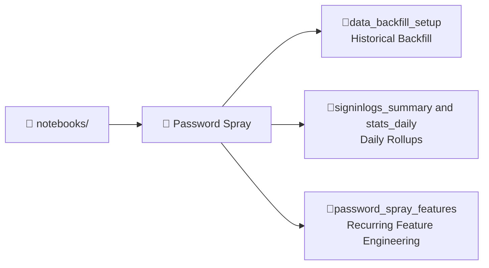

# 📓 Security Analytics Notebooks for Microsoft Sentinel data lake

This repository contains a collection of **modular Jupyter/Spark notebooks** designed for use with Microsoft Sentinel and the Security Data Lake.  
Each folder focuses on a specific detection or analysis scenario, with supporting code, documentation, and architectural diagrams.

---

## 📖 Structure

- **`Password Spray/`**  
  End-to-end pipeline for detecting password spray attacks in Azure AD `SigninLogs`.  
  Includes:

  - `data_backfill_setup` → historical backfill of summary & stats tables
  - `signinlogs_summaryandstats_daily` → daily rollups for efficiency
  - `password_spray_features` → recurring feature engineering with spray score

---

## 🏗️ Notebook Index Diagram

---

## 🚀 Getting Started

### Prerequisites

- Azure subscription with **Microsoft Sentinel** and **Security Data Lake** enabled.
- Spark environment (Azure Synapse, Fabric, or equivalent) configured to access Sentinel tables.
- Access to relevant data tables (e.g., `SigninLogs`).

### Running in VS Code

You can run these notebooks directly from VS Code using the **Synapse Notebooks extension** or the **Azure Data Lake Tools**.

📚 Reference: [Use notebooks in Microsoft Sentinel](https://learn.microsoft.com/en-us/azure/sentinel/datalake/notebooks)

Steps:

1. Clone this repository or sync with your workspace.
2. Open the desired notebook (`.ipynb`) in VS Code.
3. Select your Spark compute environment.
4. Run cells sequentially or modify parameters as needed.
5. Review outputs — each notebook includes **schema previews, diagrams, and sample rows** to guide validation.

---

## 🧩 General Design Principles

- **Separation of Concerns** → Each notebook handles a focused task (backfill, daily summaries, features).
- **Reusability** → Parameters (date ranges, table names, fields) are modular for easy customization.
- **Cost Efficiency** → Long lookbacks use compact summary tables; frequent runs only scan fresh deltas.
- **Analyst-First Outputs** → All tables are structured for alerts, dashboards, and investigations.

---

## 📂 Output Tables

While each subfolder README describes outputs in detail, the common pattern is:

- **Daily Rollups** → Compact summary tables to support efficient queries.
- **Feature Tables** → Enriched datasets with scoring/labels for detections.
- **Stats Tables** → Global metrics for KPI dashboards and baselines.

---

## 📌 Next Steps

- Explore the `Password Spray/` folder for a complete example pipeline.
- Extend with new detection scenarios for datalake.
- Contribute additional notebooks following the same modular structure.
