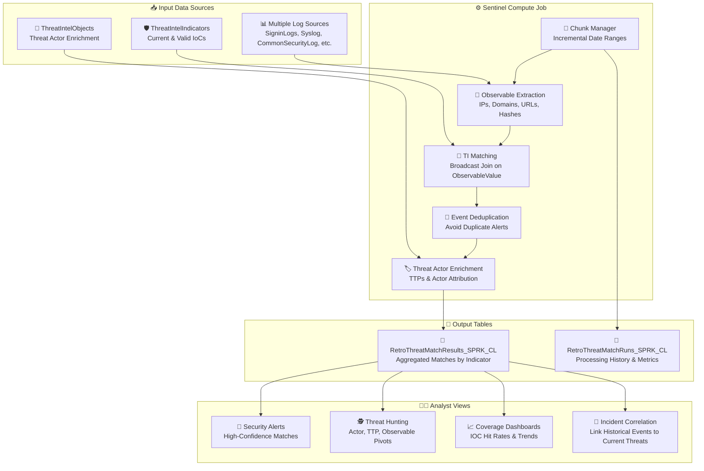

# 🔍 Threat Intelligence Retroactive Matching – End-to-End Pipeline

This folder contains a Spark notebook that implements a **comprehensive, incremental pipeline** for correlating Threat Intelligence (TI) indicators with historical log data across multiple Microsoft Sentinel sources.

---

## 📖 Workflow summary

1. **`TI-Retroactive-Hunting`**
   - Loads Threat Intelligence Indicators from `ThreatIntelIndicators` table.
   - Correlates indicators with multiple log sources over a configurable lookback period.
   - Enriches matches with threat actor intelligence and attack patterns from `ThreatIntelObjects`.
   - Processes data in **configurable chunks** to avoid reprocessing historical data.
   - Deduplicates matches to prevent duplicate alerts on subsequent runs.
   - Aggregates results by TI indicator with event references for detailed analysis.
   - Outputs to `RetroThreatMatchResults_SPRK_CL` for **alerts, investigations, and threat hunting**.

---

## ⚡ Why this design is efficient

- **Incremental processing** – Tracks completed runs to avoid reprocessing historical chunks.
- **Backward-fill strategy** – Fills historical gaps first, then catches up to present.
- **Event-level deduplication** – Prevents duplicate alerts when matching overlapping time windows.
- **Configurable chunk sizes** – Balance between memory usage and processing frequency (default: 30 days).
- **Multi-source support** – Match indicators across 30+ log tables with flexible field mapping.
- **Broadcast optimization** – Uses broadcast joins for TI indicators to minimize shuffle operations.

---

## 🚀 Outputs & use cases

- **Proactive Threat Hunting** → Identify historical compromises from newly discovered indicators.
- **Incident Investigation** → Pivot on threat actors, TTPs, and observable values.
- **Threat Actor Attribution** → Link indicators to known adversaries with enriched context.
- **IOC Coverage Analysis** → Measure which indicators are triggering matches across your environment.
- **Historical Breach Detection** → Discover evidence of compromise that predates indicator publication.

---

## 🏗️ High-level architecture



---

## 🎯 Key features

### Multiple Log Source Support
- **Azure AD Logs**: SigninLogs, AADNonInteractiveUserSignInLogs, AADServicePrincipalSignInLogs, AADManagedIdentitySignInLogs, AuditLogs
- **System & Security Logs**: Syslog, WindowsEvent, SecurityEvent, CommonSecurityLog
- **Cloud & Email**: OfficeActivity, CloudAppEvents, EmailEvents, EmailUrlInfo
- **Network & Infrastructure**: DeviceNetworkEvents, DnsEvents, AzureDiagnostics, AWSCloudTrail, GCPAuditLogs
- **IoT & Specialized**: SecurityIoTRawEvent, W3CIISLog, AWSVPCFlow

### Flexible Matching Modes
- **Current** (default): Only match indicators valid at current time
- **Loose**: Ignore validity windows for maximum historical coverage

### Intelligent Processing
- **Chunked Processing**: Process 30-day windows (configurable) to manage memory
- **Backward Fill**: Automatically fills historical gaps before processing forward
- **Run Tracking**: Maintains processing history to avoid reprocessing
- **Auto-Resume**: Picks up where it left off on subsequent runs

### Threat Intelligence Enrichment
- **Threat Actor Attribution**: Links indicators to known adversaries via ThreatIntelObjects
- **TTP Mapping**: Associates MITRE ATT&CK techniques with matched indicators
- **Confidence Scoring**: Leverages enrichment context for match quality assessment

---

## 🔧 Required customer configuration

### Workspace Configuration
```python
WORKSPACE_NAME = None  # Auto-detects first non-default workspace if None
```

### Lookback Configuration
```python
CHUNK_SIZE_DAYS = 30      # Process 30 days at a time
MAX_LOOKBACK_DAYS = 365   # Maximum historical lookback
```

### Log Source Toggles
Enable/disable specific log sources based on your environment:
```python
ENABLE_SIGNIN_LOGS = True
ENABLE_SYS_LOGS = True
ENABLE_COMMON_SECURITY_LOGS = True
ENABLE_NON_INTERACTIVE_SIGNIN_LOGS = True
ENABLE_SERVICE_PRINCIPAL_SIGNIN_LOGS = True
ENABLE_MANAGED_IDENTITY_SIGNIN_LOGS = True

# Additional sources available (see notebook for full list)
```

---

## 📚 Output table schema

### `RetroThreatMatchResults_SPRK_CL`

**Purpose:** Aggregated matches by TI indicator with event references for detailed investigation.

| Column Name | Type | Description |
|-------------|------|-------------|
| **MatchId** | string | Unique identifier for the match (references ThreatIntelIndicators.Id) |
| **JobId** | string | Unique identifier for the job execution run |
| **JobStartTime** | datetime | Timestamp when the matching job started |
| **JobEndTime** | datetime | Timestamp when the matching job completed |
| **MatchType** | string | Type of match (e.g., "IoC") |
| **ObservableType** | string | Subtype of observable (e.g., "ipv4-addr:value", "domain-name:value") |
| **ObservableValue** | string | The actual observable value that matched (IP, domain, URL, hash, etc.) |
| **TIReferenceId** | string | Reference to the original Threat Intelligence record |
| **TIValue** | string | Pattern or value from the TI indicator that was matched |
| **MatchCount** | long | Number of events that matched this indicator |
| **EventReferences** | string (JSON array) | Array of matched events: `[{"Table":"SigninLogs","RecordId":"abc123","TimeGenerated":"...","LogField":"IPAddress","MatchedValue":"1.2.3.4"}]` |
| **TTPs** | string (JSON array) | MITRE ATT&CK techniques associated with this indicator (e.g., `["T1059","T1071.001"]`) |
| **ThreatActors** | string (JSON array) | Threat actor names linked to this indicator |
| **EnrichmentContext** | string (JSON) | Additional context from ThreatIntelIndicators.Data field |
| **TenantId** | string | Azure tenant identifier |
| **TimeGenerated** | datetime | Timestamp when this match record was created |

### `RetroThreatMatchRuns_SPRK_CL`

**Purpose:** Tracking table for processing history and metrics.

| Column Name | Type | Description |
|-------------|------|-------------|
| **JobId** | string | Unique identifier for the job run |
| **StartDate** | datetime | Start of the date range processed in this chunk |
| **EndDate** | datetime | End of the date range processed in this chunk |
| **RecordsProcessed** | int | Total log records processed |
| **TIMatchesFound** | int | Number of unique TI indicators that matched |
| **EventMatchesFound** | int | Total number of event matches found |
| **RunDurationMinutes** | string | Duration of the job run |
| **TenantId** | string | Azure tenant identifier |
| **TimeGenerated** | datetime | Timestamp when run record was created |

---

## 🔄 Processing behavior

### First Run
- Creates initial chunk (default: last 30 days)
- Populates `RetroThreatMatchResults_SPRK_CL` with matches
- Records run in `RetroThreatMatchRuns_SPRK_CL`

### Subsequent Runs
- Checks for historical gaps (backward fill)
- Fills gaps up to `MAX_LOOKBACK_DAYS` (default: 365 days)
- Once historical backlog complete, processes forward to stay current
- Deduplicates events to avoid duplicate alerts
- Only appends truly new matches

### Completion
- Stops when all historical data processed AND caught up to yesterday
- Next run will pick up any new data since last execution

---

## 🎯 Best practices

1. **Enable relevant log sources** – Only enable tables that exist in your workspace
2. **Monitor chunk size** – Adjust `CHUNK_SIZE_DAYS` based on data volume and cluster size
3. **Schedule regular runs** – Daily or weekly execution to maintain coverage
4. **Review threat actor matches** – Use enrichment data to prioritize investigations
5. **Correlate with incidents** – Link historical matches to current security events

---

## 📝 Notes

- **Ingestion delay**: Results appear in Log Analytics 5-15 minutes after job completion
- **RecordIds**: Event references will show TimeGenerated, Table, and matching log field.  If there is a unique recordId for the table that will also be listed as well.  Otherwise it will be excluded.
- **Case sensitivity**: All observable values normalized to lowercase for consistent matching

---

## 🚦 Job scheduling

Use the included `TI-Retroactive-Hunting.job.yaml` file for automated scheduling:

```yaml
# Required configurations in job.yaml:
- StartTime: Job start date/time
- EndTime: Job end date/time (optional for ongoing execution)
- JobName: Prefix with 'TI-Retroactive-Hunting'
```

These value can also be set in the Sentinel VS Code extension UI that will appear when selecting this file.

---

